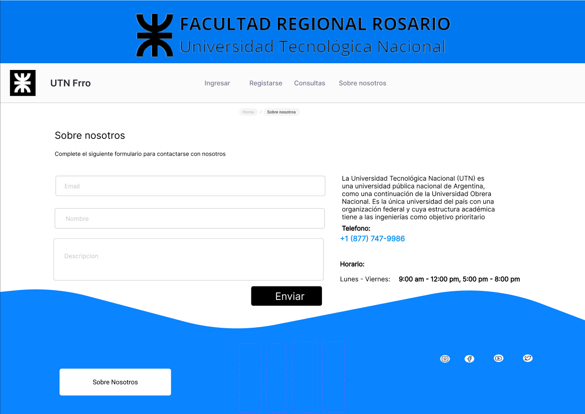

# Marco Teórico
En el marco de las clases de la Universidad Tecnológica Nacional, los profesores universitarios deben ofrecer clases de consulta a sus estudiantes, para que ellos puedan aprovechar y despejar dudas o realizar consultas puntuales que se les hayan presentado y no hayan podido resolver en clases por diversas razones.

Lo cierto es que este sistema es propenso a desencuentros o a manejos de tiempo poco eficientes, presentándose situaciones como:
- cuando no se presenta ningún estudiante a una clase de consulta
- cuando hay demasiados estudiantes y no se los puede atender a todos
- cuando un estudiante se presenta tarde y el profesor se ha ido

Por lo que diferentes profesores han adoptado formas alternativas de planificación que incluyen:
- disponer su correo electrónico para realizar consultas sólo si algún estudiante lo necesita
- utilizar herramientas de videoconferencia
- ubicar el horario de consultas inmediatamente después de sus clases

Todas estas son consideraciones extra que facilitan los malentendidos y dificultan la organización de los estudiantes al tener que considerar cada metodología diferente.

# Objetivo Principal

Mejorar la comunicación alumno-docente para reservar las consultas de las diferentes materias y profesores evitando inconvenientes. 

# Objetivos Específicos

Evitar que el alumno asista a consulta y que el docente se haya retirado o viceversa.

Organizar las consultas en caso de haber varios alumnos que la requieran.

Optimizar los tiempos de consulta.

Permitir el acceso a consultas on line.

# Descripción del Sitio

El objetivo del sitio es ofrecer un sistema de gestión de consultas sencillo y a la vez seguro, adaptable a diferentes dispositivos con necesidades similares y con una interfaz con buena usabilidad y accesibilidad para que pueda ser utilizado por cualquier tipo de usuario.

El sitio contará con diferentes módulos donde se ofrecerán las funcionalidades que ayuden a cumplir los objetivos propuestos, teniendo en cuenta los siguientes niveles de usuarios (control de privilegios):

Los usuarios sin registrarse pueden consultar los horarios de consulta de los diferentes profesores y de las diferentes cátedras, o bien registrarse para tener acceso a más posibilidades.

Al registrarse e ingresar con sus cuentas, los alumnos pueden anotarse a las diferentes clases de consulta, ver las clases de consulta a las que se pretende asistir (en las que se anotó) y avisar si no va a poder presentarse. También puede administrar su perfil básico.

Los profesores poseerán una cuenta que, al serle asignadas las materias y los horarios, tendrán la posibilidad de confirmar o en su defecto, avisar a los alumnos que no concurrirán a una determinada consulta, informando los motivos en cada ocasión. 

La administración de la universidad también tendrá acceso especial para cargar todos los horarios de consulta una vez decididos y asociarlos a las cuentas de los profesores.

# Algunos Bocetos

